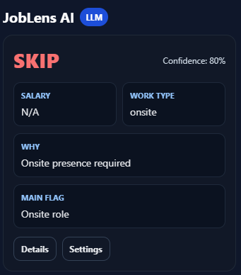
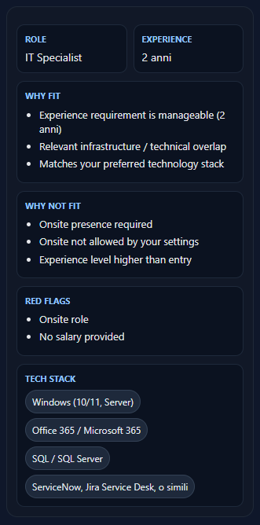

# JobLens AI

**Decide in seconds if a job is worth applying.**

JobLens AI is a Chrome extension that analyzes LinkedIn job postings in real time and reduces them to the few signals that actually matter.

It uses a local LLM via Ollama, combined with deterministic filtering logic based on your preferences.

---

JobLens reduces every job posting to 3 key signals:

- **Apply / Skip** — Instant decision
- **Salary** — If available
- **Work Type** — Remote / Hybrid / Onsite

Everything else is secondary and available in the details panel.

No more reading walls of text. Just decide and move on.

## 🧠 How It Works

1. Open a job posting on LinkedIn  
2. JobLens extracts the content  
3. A local LLM analyzes it through Ollama  
4. You get an instant decision panel  

Everything runs **locally** — your data never leaves your machine.

## ⚙️ Personalization

JobLens is designed to evaluate jobs against your own preferences, not generic rules.

Current logic supports:
- preferred role direction
- preferred technologies
- required languages
- max years of experience
- work mode preferences
- travel / on-call filtering

⚠️ The settings panel is currently under development and still in debug.

## Current Status

✅ **MVP Working (Decision-first UI)**

Implemented:
- Minimal decision panel (`Apply / Skip / Borderline`)
- Salary and Work Type extraction
- Local LLM analysis through Ollama
- LinkedIn job parsing
- Expandable details view

In progress:
- Settings logic refinement
- Salary extraction improvements
- Work type detection refinement
- Prompt accuracy tuning

## 🚀 Preview

<p align="center">
  
  
</p>

<p align="center">
  
</p>

⚠️ **Settings panel is currently under development (debug phase).**  
Some preferences may not fully apply yet. Full functionality coming soon.

## 🧩 Architecture

```text
LinkedIn Page
↓
Content Script (job extraction)
↓
Background Script
↓
Ollama (LLM - local)
↓
Normalization + Enrichment
↓
UI Injection
