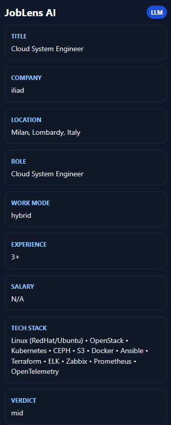

# JobLens AI

**Stop wasting time reading job postings. Let AI do it for you.**

JobLens is a Chrome extension that analyzes job postings in real-time and extracts structured insights using a local LLM (Ollama). Read once, understand everything.

## What It Does

Open a job posting on LinkedIn. JobLens injects a side panel that instantly shows:

- **Role** — What you'd actually be doing
- **Work Mode** — Remote / Hybrid / Onsite
- **Experience Level** — Years required (and if it's realistic)
- **Salary** — If posted
- **Tech Stack** — Languages, frameworks, tools
- **Verdict** — Is this a good fit? (Based on your criteria)
- **Red Flags** — Unrealistic requirements, salary mismatches, etc.

No more reading 500-word job descriptions. Just the facts.

## How It Works

1. Open a job posting on LinkedIn
2. JobLens extracts the job description
3. Local LLM (Ollama + llama3.1:8b) analyzes it
4. Structured insights appear in the side panel
5. You decide in seconds if it's worth applying

Everything runs **locally** — your data never leaves your computer.

## Tech Stack

- **Frontend:** TypeScript, React, Chrome Extension (Manifest V3)
- **AI:** Ollama + llama3.1:8b (local LLM)
- **Architecture:** Service Worker bridge for background processing

## Current Status

✅ **MVP Working**

Fully implemented:
- LinkedIn job extraction
- Chrome extension side panel UI
- Ollama integration via background service worker
- AI-powered job analysis with structured JSON output
- Real-time rendering in the UI

In progress:
- Salary extraction accuracy
- Work mode detection refinement
- Prompt engineering optimization
- LinkedIn parsing stability improvements

## Screenshot

## Why I Built This

I was drowning in job applications, wasting hours reading generic postings that didn't match my skills or timeline. I built JobLens to filter the noise and get clarity fast.

**The result?** Spend less time reading, more time applying to roles that actually fit.

## Installation

1. Clone the repo
2. Install dependencies: `npm install`
3. Build: `npm run build`
4. Load in Chrome: `chrome://extensions` → "Load unpacked" → select the `dist` folder
5. Ensure Ollama is running locally with `llama3.1:8b` model

## Next Steps

- [ ] Improve salary extraction accuracy
- [ ] Refine work mode detection
- [ ] Add visual verdict highlighting
- [ ] Expand to Indeed, RemoteOK, other job boards
- [ ] Add user preferences for filtering criteria

## License

MIT
